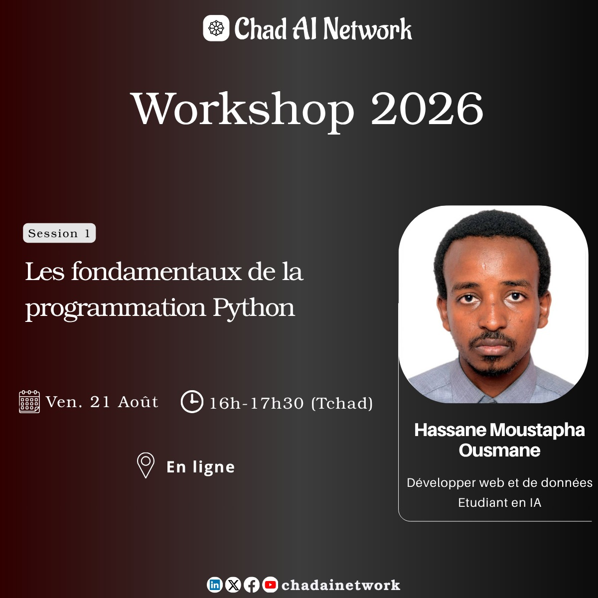

<!-- Slide 1: Flyer -->

---

<!-- Slide 2: Aperçu -->

# Les fondamentaux de la programmation Python

---

## Aperçu

Un parcours structuré pour maîtriser les bases essentielles et comprendre l'écosystème moderne de Python.

---

<!-- Slide 3: Intervenant -->

  

**Hassane Moustapha Ousmane**
*Développeur Web & de Données | Étudiant en IA*

- Passionné par la science des données et l'apprentissage automatique.
- Membre de la communauté Chad AI Network.

---

#### Les fondamentaux de la programmation Python

1. Introduction
2. Module, commentaires & pip
3. Les variables
4. Les type données

---

<!-- Slide: Introduction -->

### Introduction

#### Qu'est-ce que la programmation ?

---

<!-- Slide: Introduction -->

#### Introduction - Qu'est-ce que la programmation ?

- La programmation informatique est l'ensemble des activités liées à la conception, l'écriture, le test et la maintenance de programmes informatiques à l'aide de langages de programmation.

- C'est une façon d'intruire la machine à éffectuer des tâches variées.

---

<!-- Slide: Introduction -->

#### Introduction - Qu'est-ce que la programmation ?

- Les langages de programmation tels que *Python* sont utilisés pour communiquer avec les ordinateurs de la même façon qu'on utilise le Français ou l'Anglais pour communiquer entre nous.

- D'aprés Stack Overflow, Python est l'un des langages de programmation les plus appreciés. Il est aussi l'un des langages les plus facile.

<!-- Pour ne pas dire le plus facile. -->

---

#### Introduction - Caractéristiques principales

La popularité fulgurante s'explique par plusieurs caractéristiques clés :

- **Syntaxe claire et lisible :** Sa syntaxe est souvent comparée à l'anglais, ce qui le rend facile à apprendre et à comprendre, même pour les débutants . Le code est plus concis qu'avec d'autres langages, ce qui améliore la productivité.

- **Langage interprété :** Contrairement à des langages comme C++, le code Python est exécuté ligne par ligne par un interpréteur, sans étape de compilation préalable . Cela permet un cycle de développement rapide.

---

#### Introduction - Caractéristiques principales

- **Typage dynamique :** En Python, vous n'avez pas besoin de déclarer le type d'une variable (nombre, texte, etc.). L'interpréteur le détermine automatiquement en fonction de la valeur qui lui est assignée.

- **Gestion automatique de la mémoire :** Le langage gère lui-même l'allocation et la libération de la mémoire, grâce à un mécanisme de "garbage collection".

---

#### Introduction - Caractéristiques principales

- **Multi-paradigmes :** Python n'impose pas un seul style de programmation. Il supporte à la fois la programmation orientée objet, la programmation impérative et la programmation fonctionnelle.

- **Une contrainte forte :** l'indentation. Une particularité notable est que la structure du code (les blocs d'instructions) est définie par l'indentation (les espaces ou tabulations en début de ligne), et non par des accolades. Cela rend le code propre et uniforme, mais peut surprendre au début.

---

### Introduction

#### Pour quoi Python ?

---

<!-- Slide: Introduction -->

#### Introduction - Pour quoi Python ?

- Python est un langage de programmation de haut niveau, généraliste, interprété et orienté objet.
- C'est un langage open-source et gratuit, dont le développement est aujourd'hui géré par la **Python Software Foundation**.
- Python est simple à comprendre. C'est comme lire de l'anglais basique.

---
#### Introduction - Pour quoi Python ?

##### Domaines d'application

<!-- Sa grande polyvalence lui permet d'être utilisé dans de nombreux secteurs -->

- *Science des données et Intelligence Artificielle*
<!-- Python règne en maître dans ces domaines grâce à des bibliothèques (appelées librairies) spécialisées comme NumPy et pandas pour l'analyse de données, ou TensorFlow, scikit-learn et PyTorch pour le machine learning et le deep learning -->
- *Développement Web*
<!-- Il permet de créer des applications web robustes et évolutives avec des frameworks comme Django ou Flask . Des géants comme Instagram utilisent Django pour leur infrastructure -->
- *Automatisation et scripting*
<!-- Idéal pour écrire des scripts courts qui automatisent des tâches répétitives comme la manipulation de fichiers, l'envoi d'emails ou l'administration de systèmes -->
- *Calcul scientifique et recherche*
<!-- Ses bibliothèques (comme SciPy) et sa facilité d'utilisation en ont fait un outil de choix pour les chercheurs et scientifiques, par exemple au CERN ou à la NASA -->

---

#### Introduction - Un bref historique de Python

- **1989-1991 :** Création de Python par Guido van Rossum.

- **2000 :** Sortie de Python 2.0, apportant des fonctionnalités majeures

- **2008 :** Sortie de Python 3.0, une version non rétrocompatible avec Python 2 pour corriger des incohérences profondes du langage. Cette transition a pris des années.

<!-- - **2020 :** Fin officielle du support pour Python 2. Python 3 est désormais la seule version utilisée -->

- **2020 :** Fin officielle du support pour Python 2. Python 3 est désormais la seule version utilisée.

---
#### Introduction - Pour quoi Python ?

- Python est conçu par le programmeur néerlandais **Guido van Rossum** en **1991**.
<!-- il a été publié pour la première fois en **1991**. -->
<!-- Un nom court et unique -->
- Son nom est un hommage à la troupe comique britannique *Monty Python's Flying Circus*.

  
  *Guido Van Russom (2024)*
  <!-- PyCon US 2024 -->

---

### Introduction

#### Modules, pip & commentaires

---

#### Introduction - Les modules

- Un module est simplement un fichier (.py) contenant du code écrit pour quelqu'un d'autre (généralement) et qui peut-être importé et utilisé dans nos programme.
<!-- L'extension d'un fichier est une petite partie finale du nom d'un fichier que fait savoir à l'ordinateur le type du fichier. -->
- Un module Python est comme une boîte à outils remplit d'artefacts spéciaux (du codes).

---

#### Introduction - Les modules

##### Les types de modules

Il y a deux types de modules en Python.

- Les modules *buitl-in* (qui sont préintallés dans Python): os, random, ...
- Les modules *externes* (qui sont installés en utilisant `pip`): pandas, numpy, ...

---

#### Introduction - pip

- Pip est un gestionnaire de paquets pour Python. Il est utilisé pour installer (et gérer) les modules sur notre système.
- <u>Exemple</u>: Installer `flask` avec pip

`pip install flask`

---

#### Introduction - Les commentaires

- Les commentaires sont utilisés pour écrire ce qui sera ingoré par l'interpréteur Python. On peut les utiliser pour expliquer nos lignes de codes par exemple.
<!-- Ou pour spécifier l'auteur, la date, des note, ... -->
- Un commenteur commence par le caractère ***#*** (on le place au début de la ligne).
- On peut utiliser le racourci clavier `Ctr + /` pour commenter une ligne.

---

#### Introduction - Les commentaires

##### Les types de commentaire

Il y a deux types de commentaires en Python:

- Les commentaires sur une ligne (single lige comments).
<!-- # This is a single line comment -->
- Les commentaires multi-lignes (multiline comments)
Pour écrire un commentaire sur plusieurs lignes, on peut utiliser soit `#` au début de chaque ligne ou `""""""`.
<!-- # est plus souvent utilisé que """""".
On peut faciler commuter (toggle) entre commenter/decommenter en utilisant `Ctr + /`-->

---

### Introduction

#### Utiliser Python telle une calculatrice

<!-- Ouvrir le REPL (Read Evaluate Print Loop) de Python en entrant `python` sur le teminal puis Entrer.
Un REPL python permet d'exécuter du code Python ligne par ligne et de voir le résultat instantanément. -->

---

### Introduction

#### Un peu de pratique

---

#### Introduction - Un peu de pratique

<!--
Le Corbeau et le Renard

Maître Corbeau, sur un arbre perché, 
Tenait en son bec un fromage.
Maître Renard, par l’odeur alléché, 
Lui tint à peu près ce langage:
Hé!  Bonjour, Monsieur du Corbeau.
Que vous êtes joli! Que vous me semblez beau!
Sans mentir, si votre ramage
Se rapporte à votre plumage,
Vous êtes le phénix des hôtes de ces bois.
A ces mots le corbeau ne se sent pas de joie;
Et, pour montrer sa belle voix, 
Il ouvre un large bec, laisse tombe sa proie.
Le renard s’en saisit, et dit: Mon bon monsieur,
Apprenez que tout flatteur
Vit aux dépens de celui qui l’écoute:
Cette leçon vaut bien un fromage, sans doute.
Le corbeau, honteux et confus,
Jura, mais un peu tard, qu’on ne l’y prendrait plus.
-->
1. Écrire un programme Python qui affiche le poem *Le Corbeau et le Renard*.
2. Utiliser REPL et afficher la table de multiplication par 5.
3. Installer un module externe et l'utiliser pour éffectuer une opération qui vous interesse.
4. Écrire un programme qui affiche le contenu d'un dossier en utilisant la bibliothèque prédéfini `os`.
5. Commenter le programme écrit en 4.

---

### Les variables et les types de données

---

#### Les variables

- Une variable est un espace mémoire nommé qui stocke une valeur.
- C'est un conteneur permettant de sauvegarder une valeur.
- <u>Exemple</u>: `age = 25` `name = "Mariam` `temperature = 38.7`

---

#### Les variables - Convention de nommage

<!-- Il y a quelques règle à suivre lorsqu'on veut nommé une variable (ou tout autre identifiant). 
Un identifiant est tout simplement le nom d'une variable, fonction ou classe, ... -->
- Le nom d'une variable ne peut contenir que des lettres alphabétiques, des chiffres et le underscore (tiret de 8 _).
- Le nom d'une variable ne peut commencer qu'avec une lettre ou un underscore.
- Le nom d'une varibale ne peut pas commencer avec un chiffre.
- Pas d'espace autorisé dans le nom d'une variable.

---

### Les type de données

---

#### Les type de données

- En Python, tout est objet et chaque objet a un type. Le type détermine : les valeurs possibles, les opérations autorisées, la manière dont les données sont stockées en mémoire.

- Python est à typage dynamique &rarr; le type est inféré automatiquement lors de l'exécution.

- <u>Exemple</u>:
`x = 42        # type: int`
`x = "Bonjour" # maintenant, type: str (pas d'erreur !)`

---

#### Les type de données - Les types de base (types primitifs)

Type | Description | Exemple
--- | --- | ---
`int` | Entiers (taille illimitée) | 42, -3, 1_000_000
`float` | Nombres à virgule flottante | 3.14, -0.001, 1.2e5
`complex` | Nombres complexes | 3+4j, 1.2-0.5j
`bool` | Valeurs booléennes | True, False

<!-- Exemple
age = 25               # int
pi = 3.14159           # float
nombre_complexe = 2+3j # complex
est_majeur = True      # bool

print(type(age))       # <class 'int'>
print(type(pi))        # <class 'float'>
-->

<!--
Type | Description | Exemple
--- | --- | ---
int | Entiers (taille illimitée) | 42, -3, 1_000_000
float | Nombres à virgule flottante (double précision) | 3.14, -0.001, 1.2e5
complex | Nombres complexes | 3+4j, 1.2-0.5j
bool | Valeurs booléennes (sous-classe de int) | True, False -->

---

##### Les type de données - Les chaînes de caractères (`str`)

- Les chaînes sont immutables (non modifiables) et peuvent être délimitées par `'`, `"` ou `"""` (multi-lignes).

- <u>Exemple</u>: `message = "Bonjour le monde"`

<!--
message = "Bonjour le monde"
print(len(message))          # 17
print(message[0])            # 'B'
print(message[8:])           # "le monde"
print(message.upper())       # "BONJOUR LE MONDE"
-->

---

##### Les type de données - Les fonctions des strings

- `string.endswith("sub")` : cette méthode vérifie si la variable `string` se termine ou non par la chaîne `"sub"`.
- `string.count("c")` compte le nombre d'occurrences du caractère `c`.
- `string.capitalizer()` met en majuscule la première lettre de la chaîne donnée.
- `String.lower()` convertit tous les caractères d'une chaîne en minuscules.

---

##### Les type de données - Les fonctions des strings

- `string.upper()` convertit tous les caractères d'une chaîne en majuscules.
- `string.title()` met une majuscule à la première lettre de chaque mot de la chaîne.
- `str()` convertit un objet en chaîne de caractères.
- `strip()` supprime les espaces blancs en début et en fin de chaîne.
- `lstrip()` et `rsthip()` suppriment respectivement les espaces blancs en début et en fin de chaîne.

---

##### Les type de données - Les fonctions des strings

- `zfill(width)` complète la chaîne avec des zéros à gauche jusqu’à la largeur spécifiée.
- `string.find(word)` recherche un mot dans la chaîne et renvoie l’index de la première occurrence (caractère suivant) de ce mot.
- `string.replace(old_word, new_word)` remplace l’ancien mot par le nouveau dans la...

---

##### Les type de données - Les séquences

Type | Caractéristiques | Mutabilité | Exemple
--- | --- | --- | ---
`list` | Ordonnée, permet des éléments de types différents | Mutable | [1, "a", 3.14]
`tuple` | Ordonnée, généralement des éléments de types différents | Immutable | (1, "a", 3.14)
`range` | Séquence d'entiers (générée à la volée) | - | range(0, 10, 2)

---

##### Les type de données - Les associations clé-valeur

Type | Caractéristiques | Exemple
--- | --- | ---
`dict` | Associatif, clés uniques, accès par clé (non par index) | {"nom": "Dupont", "age": 30}
`set` | Collection non ordonnée d'éléments uniques | {1, 2, 3, 4}
`frozenset` | Version immutable du set | frozenset({1, 2, 3})

<!--
# dictionnaire
personne = {
    "nom": "Dupont",
    "age": 30,
    "ville": "Paris"
}
print(personne["nom"])      # "Dupont"
personne["age"] = 31        # modification

# ensemble (set)
ensemble = {1, 2, 3, 3, 2}  # → {1, 2, 3} (les doublons sont éliminés)
print(2 in ensemble)        # True
-->

---

##### Les type de données - La fonction `type()` & typecasting

- La fonctin prédéfini `type()` permet de déterminer (vérification strict) le type de données d'une variable.
- La conversion explicite de type (*typecasting* ou transtypage) est une méthode utilisée pour convertir une valeur d'un type à un autre dans l'optique d'éffectuer certaines opération.
- En Python, le casting est éffectué en utilisant les constructures de types de données.

---

##### Les type de données - La fonction `type()` & typecasting

- `int()`: construit un entier à partir d'un int, d'un float ou d'un string (à condition que ça représent un entier)
- `float()`: construit un float à partir d'un int, d'un float ou d'un string (à condition que ça représent un nombre à vigule flottante)
- `str()`: construit une string à partir d'une large variété de types (dont int, float, ...)
<!-- - `list("ABC")`: construit un entier à partir d'un int, d'un float ou d'un string (à condition que ça représent un entier)
- `tuple([1, 2, 3])`: construit un entier à partir d'un int, d'un float ou d'un string (à condition que ça représent un entier)
- `set([1, 2, 2, 3])`: construit un entier à partir d'un int, d'un float ou d'un string (à condition que ça représent un entier) -->

<!-- Exemple
int("42")          # 42
str(3.14)          # "3.14"
list("ABC")        # ['A', 'B', 'C']
tuple([1, 2, 3])   # (1, 2, 3)
set([1, 2, 2, 3])  # {1, 2, 3}
-->
